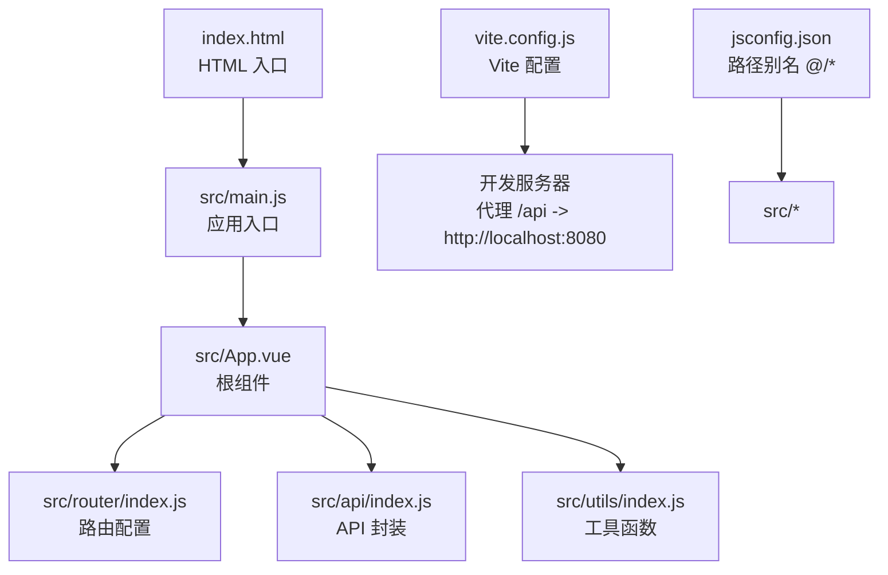
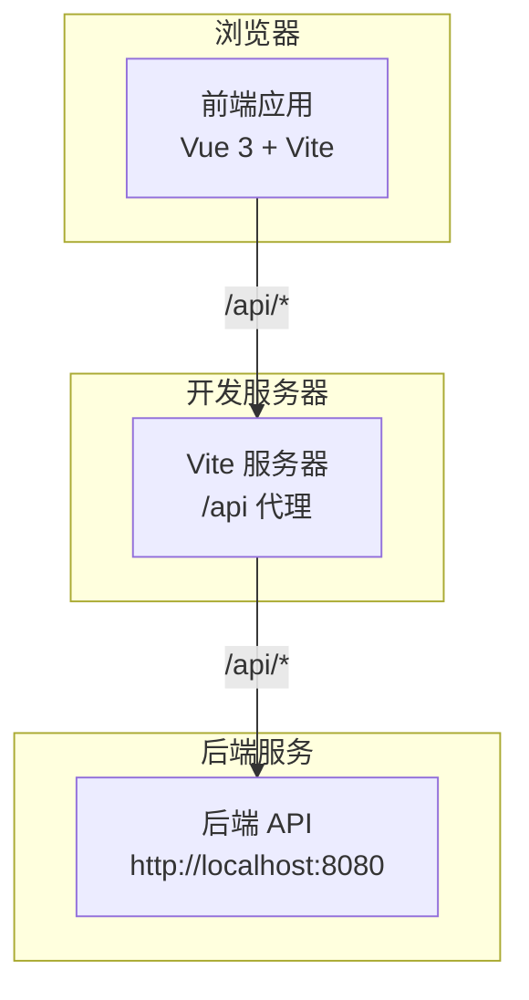
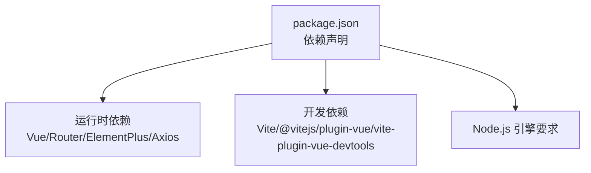

# 快速开始

<cite>
**本文引用的文件**
- [package.json](file://package.json)
- [vite.config.js](file://vite.config.js)
- [README.md](file://README.md)
- [src/main.js](file://src/main.js)
- [index.html](file://index.html)
- [src/api/index.js](file://src/api/index.js)
- [src/router/index.js](file://src/router/index.js)
- [jsconfig.json](file://jsconfig.json)
- [src/utils/index.js](file://src/utils/index.js)
- [src/App.vue](file://src/App.vue)
- [src/views/Home.vue](file://src/views/Home.vue)
- [数据库.sql](file://数据库.sql)
</cite>

## 目录
1. [简介](#简介)
2. [项目结构](#项目结构)
3. [核心组件](#核心组件)
4. [架构总览](#架构总览)
5. [详细组件分析](#详细组件分析)
6. [依赖分析](#依赖分析)
7. [性能考虑](#性能考虑)
8. [故障排除指南](#故障排除指南)
9. [结论](#结论)
10. [附录](#附录)

## 简介
本指南面向首次接触小说平台前端项目的开发者，帮助你快速完成环境准备、安装依赖、启动开发服务器，并理解项目的关键配置与目录组织。项目基于 Vue 3 + Vite + Element Plus，采用 Composition API 与 `<script setup>`，通过 Axios 进行 API 通信，并内置双 Token 自动刷新机制与路由权限守卫。

## 项目结构
项目采用按功能模块划分的目录组织方式，入口文件为 index.html，应用根组件为 App.vue，路由集中在 router/index.js，API 封装在 api/index.js，工具函数位于 utils/index.js。路径别名通过 jsconfig.json 和 Vite 的 alias 配置统一指向 src 目录。

图表来源
- [index.html:1-14](file://index.html#L1-L14)
- [src/main.js:1-17](file://src/main.js#L1-L17)
- [src/App.vue:1-646](file://src/App.vue#L1-L646)
- [src/router/index.js:1-189](file://src/router/index.js#L1-L189)
- [src/api/index.js:1-168](file://src/api/index.js#L1-L168)
- [src/utils/index.js:1-102](file://src/utils/index.js#L1-L102)
- [vite.config.js:1-28](file://vite.config.js#L1-L28)
- [jsconfig.json:1-9](file://jsconfig.json#L1-L9)

章节来源
- [README.md:17-80](file://README.md#L17-L80)
- [index.html:1-14](file://index.html#L1-L14)
- [src/main.js:1-17](file://src/main.js#L1-L17)
- [jsconfig.json:1-9](file://jsconfig.json#L1-L9)
- [vite.config.js:1-28](file://vite.config.js#L1-L28)

## 核心组件
- 应用入口与插件注册：在 main.js 中创建 Vue 应用实例，挂载路由与 Element Plus，并全局注册 Element Plus 图标组件。
- 根组件与导航：App.vue 提供头部导航、底部操作区、玻璃拟态风格与雪花背景动画；根据登录状态与角色动态显示菜单项。
- 路由与权限：router/index.js 定义公共页面、读者端、作者端、管理员端路由，并通过 before 每次导航前检查登录状态与角色权限。
- API 封装与拦截器：api/index.js 使用 Axios 创建带基础路径的实例，实现请求头自动附加 accessToken、响应拦截器处理 401 并静默刷新 token。
- 工具函数：utils/index.js 提供防抖、节流、响应处理辅助方法，统一错误消息与成功回调处理。

章节来源
- [src/main.js:1-17](file://src/main.js#L1-L17)
- [src/App.vue:1-646](file://src/App.vue#L1-L646)
- [src/router/index.js:1-189](file://src/router/index.js#L1-L189)
- [src/api/index.js:1-168](file://src/api/index.js#L1-L168)
- [src/utils/index.js:1-102](file://src/utils/index.js#L1-L102)

## 架构总览
前端通过 Vite 提供开发服务器，开发时将以 /api 前缀的请求代理到后端服务（默认 http://localhost:8080）。应用通过 Vue Router 实现页面级导航与权限控制，Element Plus 提供 UI 组件库，Axios 负责 HTTP 通信与双 Token 自动刷新。

图表来源
- [vite.config.js:18-27](file://vite.config.js#L18-L27)
- [src/api/index.js:3-6](file://src/api/index.js#L3-L6)

章节来源
- [vite.config.js:1-28](file://vite.config.js#L1-L28)
- [src/api/index.js:1-168](file://src/api/index.js#L1-L168)

## 详细组件分析

### 环境要求与安装步骤
- Node.js 版本要求：请确保本地 Node.js 版本满足 package.json 中 engines 字段的要求。
- 后端服务：开发时需确保后端服务运行在 http://localhost:8080，Vite 代理会将 /api 前缀请求转发到该地址。
- 安装依赖：在项目根目录执行依赖安装命令。
- 启动开发服务器：执行开发命令后，浏览器访问默认端口即可看到首页。
- 构建与预览：构建生产包并本地预览生产构建结果。

章节来源
- [package.json:23-25](file://package.json#L23-L25)
- [README.md:84-103](file://README.md#L84-L103)
- [vite.config.js:18-27](file://vite.config.js#L18-L27)

### 开发服务器与常用命令
- dev：启动 Vite 开发服务器，支持热更新与代理。
- build：打包生产版本，输出至 dist 目录。
- preview：本地预览生产构建结果，便于验证打包产物。

章节来源
- [package.json:6-10](file://package.json#L6-L10)

### Vite 配置与代理设置
- 插件：启用 Vue 插件与 Vue Devtools 插件。
- 路径别名：将 @ 映射到 src 目录，便于在组件中使用相对路径导入。
- 服务器代理：将 /api 前缀请求代理到 http://localhost:8080，便于前后端联调。
- 允许主机：允许任意主机访问开发服务器（开发场景）。

章节来源
- [vite.config.js:1-28](file://vite.config.js#L1-L28)
- [jsconfig.json:1-9](file://jsconfig.json#L1-L9)

### API 地址与 Axios 配置
- 基础路径：API 实例的基础路径为 /api，所有模块化接口均以此为前缀。
- 请求拦截器：自动从 localStorage 读取 accessToken 并附加到 Authorization 头。
- 响应拦截器：当响应状态为 401 且非刷新请求时，触发静默刷新流程，更新本地 token 并重放排队请求。
- 模块化接口：按业务域拆分为认证、用户、小说、章节、书架、评论等模块，便于维护与复用。

章节来源
- [src/api/index.js:1-168](file://src/api/index.js#L1-L168)

### 路由与权限控制
- 路由定义：包含公共页面、读者端、作者端、管理员端路由，部分路由带有 requiresAuth 与 role 元信息。
- 导航守卫：每次导航前检查是否需要登录与角色权限，未满足则重定向或跳转到无权限页面。
- 滚动行为：路由切换时滚动到顶部，提升用户体验。

章节来源
- [src/router/index.js:1-189](file://src/router/index.js#L1-L189)

### 根组件与导航
- 头部导航：根据登录状态与角色显示不同菜单项，支持下拉菜单与退出登录。
- 底部操作区：读者端显示成为作者按钮，管理员端显示管理后台入口。
- 雪花动画：通过预生成的雪花数据实现背景动画，优化性能。
- SVG 图标：通过自定义 SvgIcon 组件统一管理图标资源。

章节来源
- [src/App.vue:1-646](file://src/App.vue#L1-L646)

### 入口页与角色选择
- 入口页：Home.vue 提供读者、作者、管理员三类角色入口卡片，点击后跳转到对应登录页。
- 雪花动画：同样采用雪花背景与卡片内雪花装饰，营造统一视觉风格。

章节来源
- [src/views/Home.vue:1-432](file://src/views/Home.vue#L1-L432)

### 工具函数
- 防抖与节流：提供通用的防抖与节流实现，支持 leading/trailing 控制。
- 响应处理：统一判断响应是否成功、提取 data、获取错误消息与处理回调。

章节来源
- [src/utils/index.js:1-102](file://src/utils/index.js#L1-L102)

## 依赖分析
- 运行时依赖：Vue 3、Vue Router、Element Plus、Axios。
- 开发依赖：Vite、@vitejs/plugin-vue、vite-plugin-vue-devtools。
- Node.js 引擎：要求 Node.js 版本满足 engines 字段。

图表来源
- [package.json:11-25](file://package.json#L11-L25)

章节来源
- [package.json:11-25](file://package.json#L11-L25)

## 性能考虑
- 路由懒加载：路由组件通过动态导入实现按需加载，减少首屏体积。
- 组件懒加载：路由组件内部也采用动态导入，进一步优化加载性能。
- 雪花动画：通过预生成雪花数据并在 mounted 时一次性赋值，避免重复计算。
- 防抖与节流：在高频事件中使用防抖与节流，降低重绘与请求频率。
- 代理与缓存：开发阶段使用 Vite 代理，避免跨域问题；生产构建后由后端统一处理静态资源与缓存策略。

章节来源
- [src/router/index.js:1-189](file://src/router/index.js#L1-L189)
- [src/App.vue:138-264](file://src/App.vue#L138-L264)
- [src/utils/index.js:1-102](file://src/utils/index.js#L1-L102)

## 故障排除指南
- 启动失败（Node 版本不匹配）
  - 现象：安装或启动时报错，提示 Node 版本不符合 engines 要求。
  - 解决：升级或切换到符合要求的 Node.js 版本。
  - 参考：[package.json:23-25](file://package.json#L23-L25)

- 无法访问后端 API（404/跨域）
  - 现象：浏览器控制台出现跨域错误或 404。
  - 解决：确认后端服务已在 http://localhost:8080 运行；检查 Vite 代理配置是否正确；确保请求路径以 /api 开头。
  - 参考：[vite.config.js:18-27](file://vite.config.js#L18-L27)，[src/api/index.js:3-6](file://src/api/index.js#L3-L6)

- 登录后仍提示未授权
  - 现象：登录成功但页面跳转到无权限或路由被拦截。
  - 解决：检查 localStorage 中是否存在有效的 accessToken 与 userStatus；确认用户角色是否满足目标路由的 role 要求。
  - 参考：[src/router/index.js:171-186](file://src/router/index.js#L171-L186)

- Token 刷新失败导致请求中断
  - 现象：出现 401 且自动刷新失败。
  - 解决：检查 refreshToken 是否存在；确认后端 /auth/refresh 接口可用；清理本地存储的 token 后重新登录。
  - 参考：[src/api/index.js:22-79](file://src/api/index.js#L22-L79)

- 路由跳转无效或白屏
  - 现象：点击导航无反应或页面空白。
  - 解决：确认路由路径与组件导入是否正确；检查路由元信息与权限守卫逻辑；确保 Element Plus 插件已正确注册。
  - 参考：[src/router/index.js:1-189](file://src/router/index.js#L1-L189)，[src/main.js:1-17](file://src/main.js#L1-L17)

- 图标不显示或样式异常
  - 现象：SVG 图标缺失或样式错乱。
  - 解决：确认 Element Plus 图标已全局注册；检查 SvgIcon 组件的渲染逻辑与样式作用域。
  - 参考：[src/main.js:12-15](file://src/main.js#L12-L15)，[src/App.vue:172-201](file://src/App.vue#L172-L201)

## 结论
通过本快速开始指南，你可以完成环境准备、安装依赖、启动开发服务器，并理解项目的代理配置、API 地址、路由权限与工具函数等关键点。建议在开发过程中结合 README 的技术栈与功能模块说明，逐步熟悉各模块职责与协作关系。

## 附录
- 数据库脚本：项目提供了完整的数据库建表脚本，可用于初始化后端数据库。
- 批量导入工具：前端提供离线批量导入工具页面，可直接访问并上传 JSON 数据进行导入。

章节来源
- [数据库.sql:1-119](file://数据库.sql#L1-L119)
- [README.md:175-213](file://README.md#L175-L213)