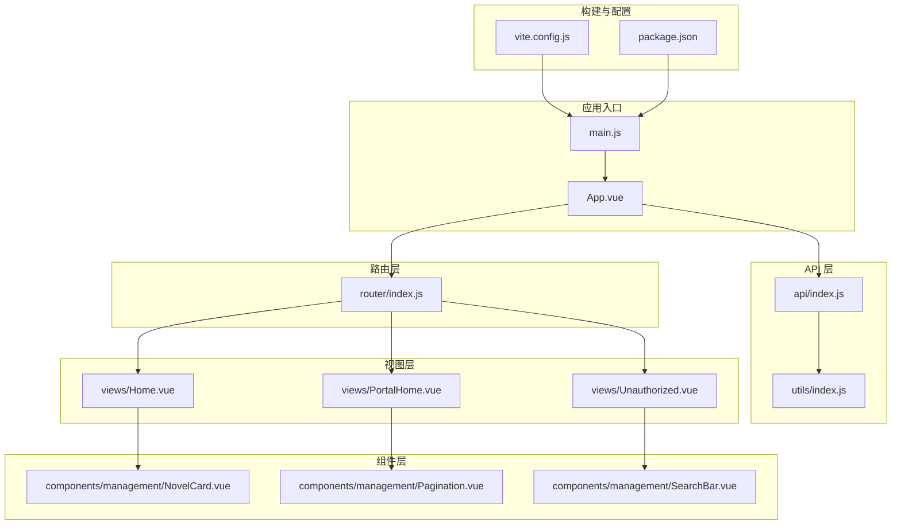
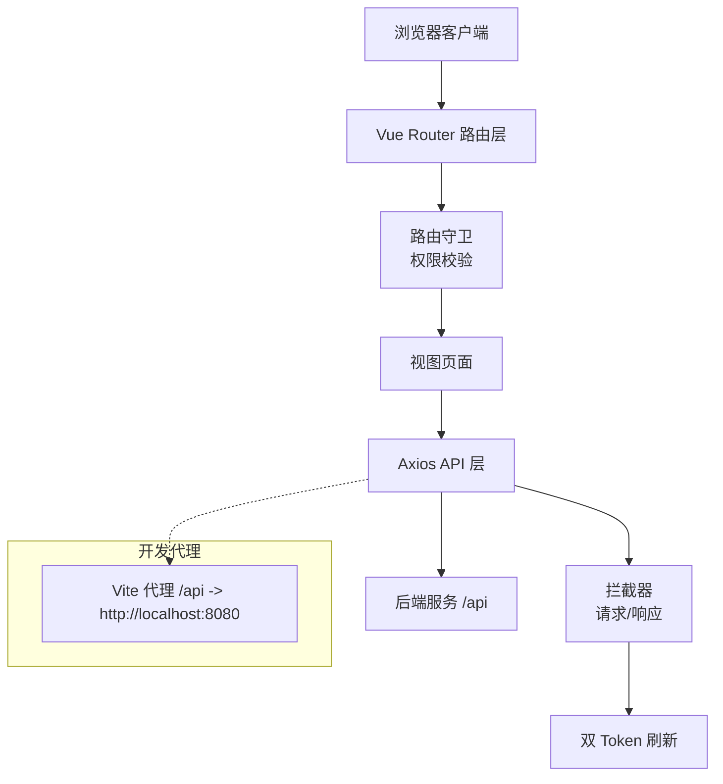
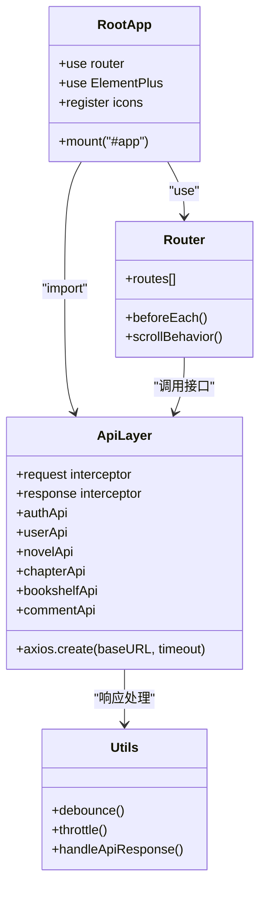
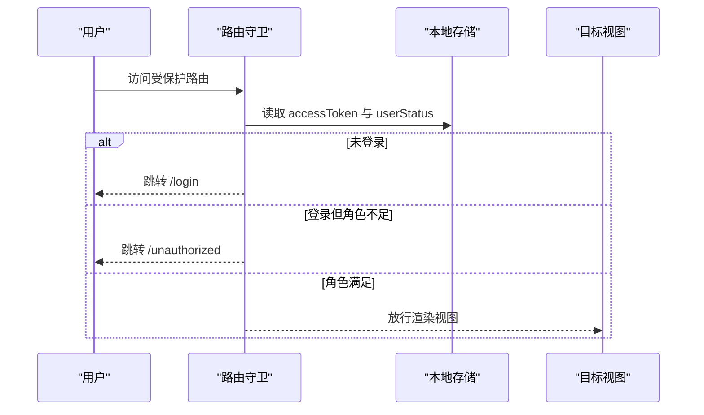
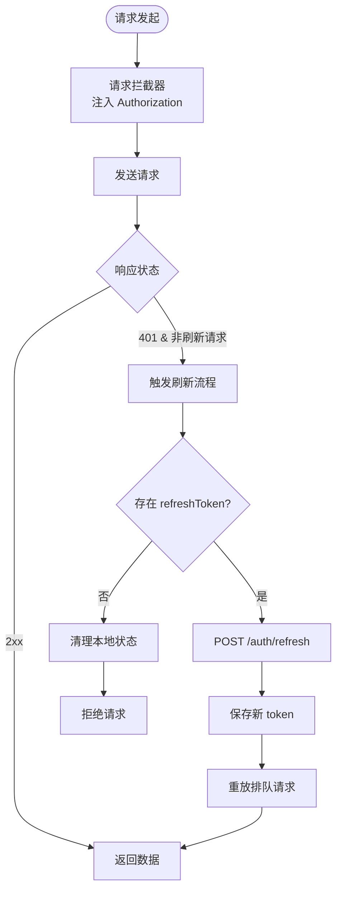
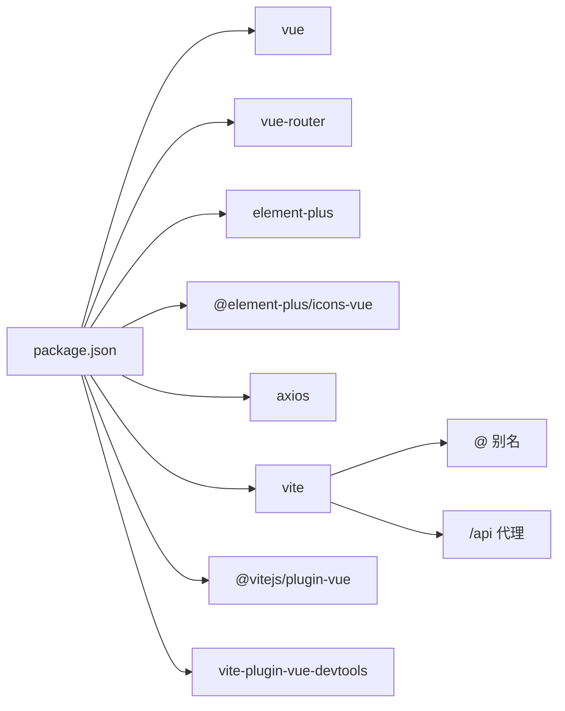

# 系统架构

<cite>
**本文引用的文件**
- [main.js](file://src/main.js)
- [App.vue](file://src/App.vue)
- [router/index.js](file://src/router/index.js)
- [api/index.js](file://src/api/index.js)
- [utils/index.js](file://src/utils/index.js)
- [vite.config.js](file://vite.config.js)
- [package.json](file://package.json)
- [Home.vue](file://src/views/Home.vue)
- [PortalHome.vue](file://src/views/PortalHome.vue)
- [Unauthorized.vue](file://src/views/Unauthorized.vue)
- [components/management/NovelCard.vue](file://src/components/management/NovelCard.vue)
- [components/management/Pagination.vue](file://src/components/management/Pagination.vue)
- [components/management/SearchBar.vue](file://src/components/management/SearchBar.vue)
- [README.md](file://README.md)
</cite>

## 目录
1. [引言](#引言)
2. [项目结构](#项目结构)
3. [核心组件](#核心组件)
4. [架构总览](#架构总览)
5. [详细组件分析](#详细组件分析)
6. [依赖分析](#依赖分析)
7. [性能考虑](#性能考虑)
8. [故障排查指南](#故障排查指南)
9. [结论](#结论)
10. [附录](#附录)

## 引言
本系统是一个基于 Vue 3 的小说阅读平台，采用 MVVM 架构与组件化设计，支持读者、作者、管理员三类角色。前端通过 Vue Router 实现多角色权限控制与动态导航，通过 Axios 实现 API 层封装与双 Token 自动刷新机制。系统采用 Element Plus 提供基础 UI 能力，并通过 Vite 进行构建与本地代理，形成前后端分离的现代化 Web 应用。

## 项目结构
项目采用按功能域划分的目录组织方式，核心模块包括入口应用、路由配置、API 封装、通用组件、视图页面等。整体结构清晰，职责边界明确，便于扩展与维护。

**图表来源**
- [main.js:1-17](file://src/main.js#L1-L17)
- [App.vue:1-646](file://src/App.vue#L1-L646)
- [router/index.js:1-189](file://src/router/index.js#L1-L189)
- [api/index.js:1-168](file://src/api/index.js#L1-L168)
- [utils/index.js:1-102](file://src/utils/index.js#L1-L102)
- [vite.config.js:1-28](file://vite.config.js#L1-L28)
- [package.json:1-27](file://package.json#L1-L27)

**章节来源**
- [README.md:17-80](file://README.md#L17-L80)
- [package.json:1-27](file://package.json#L1-L27)

## 核心组件
- 应用入口与根组件：负责全局插件注册、图标注册、路由挂载与根组件渲染。
- 路由系统：定义公共页面、读者端、作者端、管理员端路由，实现基于 meta 的权限控制与滚动行为优化。
- API 封装：统一 Axios 实例、请求/响应拦截器、模块化接口导出，支持双 Token 自动刷新。
- 工具函数：提供防抖、节流、响应处理等通用能力。
- 视图页面：包含入口页、门户页、未授权页及各功能页面。
- 通用组件：搜索栏、分页、小说卡片等，提升复用性与一致性。

**章节来源**
- [main.js:1-17](file://src/main.js#L1-L17)
- [App.vue:138-264](file://src/App.vue#L138-L264)
- [router/index.js:3-189](file://src/router/index.js#L3-L189)
- [api/index.js:3-168](file://src/api/index.js#L3-L168)
- [utils/index.js:1-102](file://src/utils/index.js#L1-L102)

## 架构总览
系统采用前后端分离架构，前端通过 Vite 构建，本地开发时通过代理将 /api 前缀请求转发至后端服务。路由层根据用户状态与路由元信息进行权限校验；API 层通过拦截器实现统一认证头注入与 401 自动刷新，确保用户体验连续性。

**图表来源**
- [router/index.js:170-186](file://src/router/index.js#L170-L186)
- [api/index.js:12-79](file://src/api/index.js#L12-L79)
- [vite.config.js:20-26](file://vite.config.js#L20-L26)

## 详细组件分析

### MVVM 架构与组件化设计
- MVVM 模式体现
  - Model：通过 API 模块封装数据访问，统一返回格式与错误处理。
  - View：以 Vue 单文件组件形式呈现，模板与样式解耦。
  - ViewModel：使用 Composition API 与 script setup，集中处理状态与业务逻辑。
- 组件化优势
  - 可复用：搜索栏、分页、小说卡片等通用组件在多页面复用。
  - 可维护：组件职责单一，便于测试与迭代。
  - 可扩展：新增页面或功能只需新增视图与必要组件，无需改动核心路由或 API。

**图表来源**
- [main.js:8-17](file://src/main.js#L8-L17)
- [router/index.js:157-168](file://src/router/index.js#L157-L168)
- [api/index.js:3-168](file://src/api/index.js#L3-L168)
- [utils/index.js:1-102](file://src/utils/index.js#L1-L102)

**章节来源**
- [App.vue:138-264](file://src/App.vue#L138-L264)
- [components/management/NovelCard.vue:48-78](file://src/components/management/NovelCard.vue#L48-L78)
- [components/management/Pagination.vue:14-57](file://src/components/management/Pagination.vue#L14-L57)
- [components/management/SearchBar.vue:17-46](file://src/components/management/SearchBar.vue#L17-L46)

### 路由架构与权限控制
- 路由分层
  - 公共页面：首页、登录、注册、作者/管理员注册与登录。
  - 读者端：小说浏览、详情、搜索、热门、完结、分类、章节列表/阅读、书架、评论。
  - 作者端：作品管理、创建、章节管理与编辑。
  - 管理员端：管理后台。
- 权限控制
  - requiresAuth：标记需要登录。
  - role：标记角色门槛（reader/writer/admin）。
  - 路由守卫：检查 accessToken 与 userStatus，未登录跳转登录，角色不足跳转未授权页。
- 导航机制
  - 使用 router-view 渲染当前页面，transition 实现页面切换动画。
  - App.vue 中根据路由路径动态显示头部导航与页脚按钮。

**图表来源**
- [router/index.js:170-186](file://src/router/index.js#L170-L186)
- [App.vue:143-154](file://src/App.vue#L143-L154)

**章节来源**
- [router/index.js:3-155](file://src/router/index.js#L3-L155)
- [App.vue:14-135](file://src/App.vue#L14-L135)

### API 层设计理念与双 Token 机制
- Axios 实例配置
  - baseURL: "/api"，timeout: 10000ms。
  - 请求拦截器：自动附加 Authorization 头。
  - 响应拦截器：401 时静默刷新 token，支持并发请求排队与重放。
- 双 Token 体系
  - 登录成功后保存 accessToken 与 refreshToken。
  - 刷新流程：调用 /auth/refresh，更新本地 token 并重放原请求。
  - 刷新失败：清理本地状态，拒绝后续请求。
- 模块化接口
  - authApi：刷新、登出。
  - userApi：用户增删改查、登录、头像上传/删除。
  - novelApi：小说 CRUD、点击/收藏/推荐、评分、热门/最新、搜索、封面上传。
  - chapterApi：章节 CRUD、按小说/编号查询、最新章节、数量统计、批量删除。
  - bookshelfApi：书架 CRUD、按用户/小说查询、检查、数量、进度更新。
  - commentApi：评论 CRUD、回复、分页、点赞/取消、统计、全量列表。

**图表来源**
- [api/index.js:12-79](file://src/api/index.js#L12-L79)

**章节来源**
- [api/index.js:3-168](file://src/api/index.js#L3-L168)

### 数据流向与通信协议
- 前后端分离
  - 前端通过 /api 前缀调用后端接口，开发环境由 Vite 代理转发至 http://localhost:8080。
- 通信协议
  - HTTP/HTTPS，JSON 数据格式。
  - 认证：Bearer Token，支持刷新。
- 错误处理
  - 统一响应处理工具：判断 code/message，提取 data/message，回调处理。

**章节来源**
- [vite.config.js:20-26](file://vite.config.js#L20-L26)
- [utils/index.js:78-102](file://src/utils/index.js#L78-L102)

### 可扩展性与可维护性设计
- 可扩展性
  - 新增角色：在路由 meta 中添加 role 字段，路由守卫自动生效。
  - 新增页面：按功能域新增视图，按需引入通用组件。
  - 新增接口：在 api/index.js 中新增模块方法，保持命名规范。
- 可维护性
  - 组件化：通用组件集中管理，减少重复代码。
  - 工具函数：防抖/节流/响应处理抽象，降低页面复杂度。
  - 配置化：Vite 别名与代理配置清晰，便于团队协作。

**章节来源**
- [router/index.js:3-155](file://src/router/index.js#L3-L155)
- [components/management/NovelCard.vue:48-78](file://src/components/management/NovelCard.vue#L48-L78)
- [utils/index.js:1-102](file://src/utils/index.js#L1-L102)

## 依赖分析
- 运行时依赖
  - vue、vue-router：框架与路由。
  - element-plus、@element-plus/icons-vue：UI 组件与图标。
  - axios：HTTP 客户端。
- 开发依赖
  - vite、@vitejs/plugin-vue、vite-plugin-vue-devtools：构建与调试。
- 构建与别名
  - @ 别名指向 src，简化导入路径。
  - 代理 /api -> http://localhost:8080，便于联调。

**图表来源**
- [package.json:11-22](file://package.json#L11-L22)
- [vite.config.js:13-27](file://vite.config.js#L13-L27)

**章节来源**
- [package.json:11-27](file://package.json#L11-L27)
- [vite.config.js:13-27](file://vite.config.js#L13-L27)

## 性能考虑
- 路由懒加载：路由组件通过动态导入实现按需加载，减少首屏体积。
- 组件懒加载：Element Plus 按需引入，避免全量引入导致体积膨胀。
- 动画与特效：雪花动画使用一次性生成数据与 CSS 动画，避免频繁计算。
- 请求缓存：建议在业务层对高频查询结果进行缓存，减少重复请求。
- 代理与跨域：开发阶段使用 Vite 代理，避免浏览器跨域限制带来的额外开销。

**章节来源**
- [router/index.js:5-34](file://src/router/index.js#L5-L34)
- [main.js:13-15](file://src/main.js#L13-L15)
- [App.vue:156-259](file://src/App.vue#L156-L259)

## 故障排查指南
- 登录后仍被重定向到登录页
  - 检查本地存储是否存在 accessToken 与 userStatus。
  - 确认路由守卫逻辑是否正确读取本地状态。
- 401 频繁出现
  - 检查 refreshToken 是否存在，确认刷新接口是否可用。
  - 查看拦截器是否正确处理 _retry 标记与 pendingRequests。
- 请求超时或跨域问题
  - 确认 Vite 代理配置是否正确，后端服务是否启动。
  - 检查 baseURL 与接口路径是否匹配。
- 未授权访问
  - 检查目标路由 meta.role 与当前 userStatus 是否匹配。
  - 确认未授权页路由是否正确配置。

**章节来源**
- [router/index.js:170-186](file://src/router/index.js#L170-L186)
- [api/index.js:12-79](file://src/api/index.js#L12-L79)
- [vite.config.js:20-26](file://vite.config.js#L20-L26)

## 结论
该小说平台以 Vue 3 为核心，结合 Element Plus 与 Vite，构建了清晰的 MVVM 架构与组件化体系。路由层通过 meta 实现多角色权限控制，API 层通过双 Token 与拦截器保障认证与稳定性。整体设计具备良好的可扩展性与可维护性，适合在多角色场景下持续演进。

## 附录
- 角色与权限对照表
  - 读者：userStatus=1，可阅读、收藏、评论。
  - 作者：userStatus≥2，读者权限 + 作品与章节管理。
  - 管理员：userStatus≥3，全部权限 + 管理后台。
- 路由一览（节选）
  - 公共：/, /login, /register, /register/writer, /register/admin, /login/admin
  - 读者：/user/profile, /user/comments, /novel/list, /novel/detail/:novelId, /novel/search, /novel/hot, /novel/completed, /novel/category, /chapter/list/:novelId, /chapter/read/:chapterId, /bookshelf, /comment/list/:novelId
  - 作者：/writer/novels, /writer/novel/create, /writer/novel/:novelId/chapters, /writer/chapter/create/:novelId, /writer/chapter/edit/:chapterId
  - 管理员：/admin/dashboard
  - 未授权：/unauthorized

**章节来源**
- [README.md:131-167](file://README.md#L131-L167)
- [router/index.js:3-155](file://src/router/index.js#L3-L155)