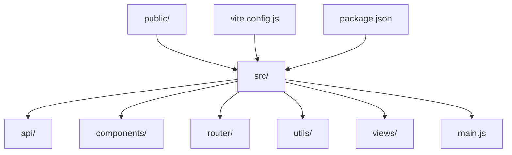
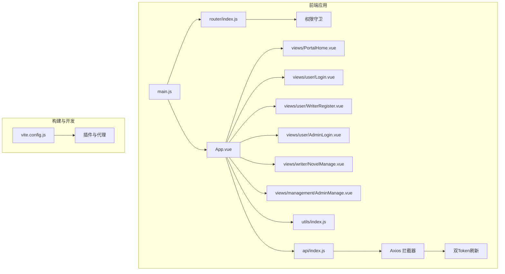
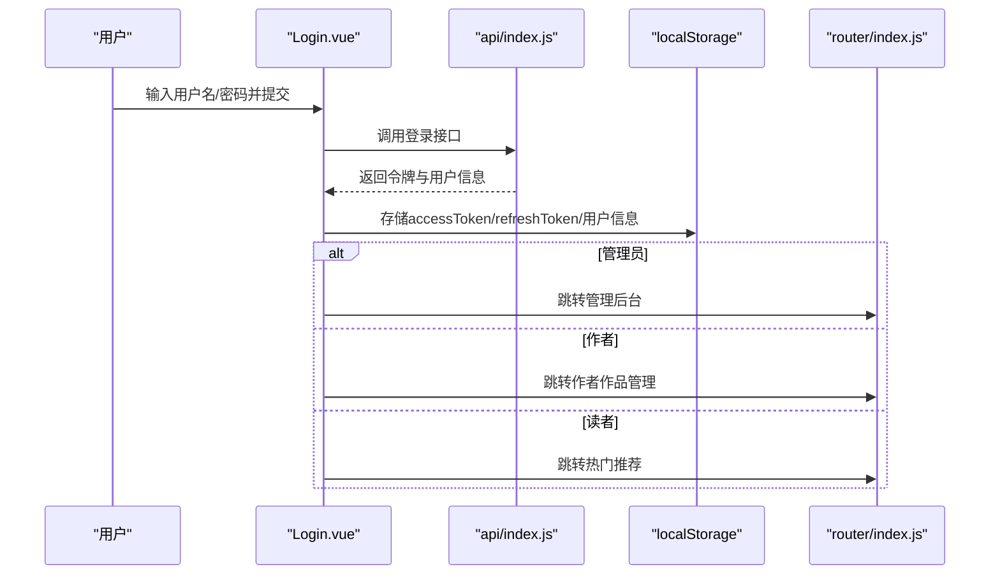
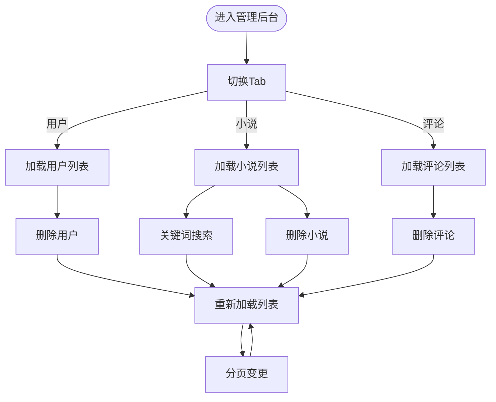
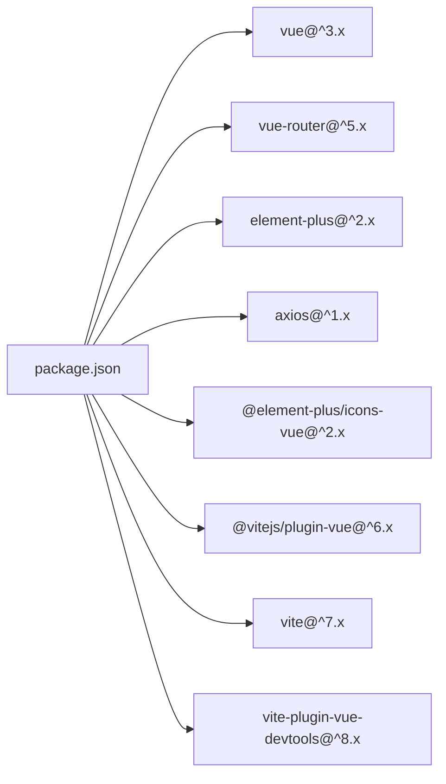

# 项目概述

<cite>
**本文引用的文件**
- [README.md](file://README.md)
- [package.json](file://package.json)
- [vite.config.js](file://vite.config.js)
- [src/main.js](file://src/main.js)
- [src/App.vue](file://src/App.vue)
- [src/router/index.js](file://src/router/index.js)
- [src/api/index.js](file://src/api/index.js)
- [src/utils/index.js](file://src/utils/index.js)
- [src/views/PortalHome.vue](file://src/views/PortalHome.vue)
- [src/views/management/AdminManage.vue](file://src/views/management/AdminManage.vue)
- [src/views/writer/NovelManage.vue](file://src/views/writer/NovelManage.vue)
- [src/views/user/Login.vue](file://src/views/user/Login.vue)
- [src/views/user/WriterRegister.vue](file://src/views/user/WriterRegister.vue)
- [src/views/user/AdminLogin.vue](file://src/views/user/AdminLogin.vue)
- [src/components/management/NovelCard.vue](file://src/components/management/NovelCard.vue)
</cite>

## 目录
1. [引言](#引言)
2. [项目结构](#项目结构)
3. [核心组件](#核心组件)
4. [架构总览](#架构总览)
5. [详细组件分析](#详细组件分析)
6. [依赖分析](#依赖分析)
7. [性能考虑](#性能考虑)
8. [故障排除指南](#故障排除指南)
9. [结论](#结论)
10. [附录](#附录)

## 引言
本项目是一个基于现代前端技术栈构建的小说阅读平台，名为“NovelHub”。平台面向三大用户角色：读者、作者与管理员，提供从阅读、创作到管理的全链路体验。项目采用响应式设计与现代化技术栈，强调用户体验与开发效率，具备清晰的角色权限体系与完善的前端工程化能力。

项目目标与价值：
- 满足读者的阅读需求：提供书库浏览、热门推荐、完结精选、分类浏览、章节阅读、书架收藏与评论互动。
- 支持作者的创作与运营：提供作品管理、章节管理、章节编辑与发布、数据统计入口。
- 提供管理员的平台治理：用户管理、小说管理、评论管理与后台仪表盘。

业务意义：
- 通过统一平台降低用户在阅读与创作两端的切换成本，提升内容生态活跃度。
- 以组件化与模块化设计支撑快速迭代，便于后续扩展更多功能模块。

## 项目结构
项目采用基于功能域的组织方式，主要目录与职责如下：
- public：静态资源与离线工具页面
- src/api：统一的HTTP客户端与模块化API封装
- src/components：公共组件与管理端组件
- src/router：路由定义与权限守卫
- src/utils：工具函数（防抖、节流、响应处理）
- src/views：按角色划分的页面视图
- src/main.js：应用入口
- vite.config.js：构建与开发服务器配置
- package.json：依赖与脚本

**图表来源**
- [src/main.js:1-17](file://src/main.js#L1-L17)
- [vite.config.js:1-28](file://vite.config.js#L1-L28)
- [package.json:1-27](file://package.json#L1-L27)

**章节来源**
- [README.md:17-80](file://README.md#L17-L80)
- [package.json:1-27](file://package.json#L1-L27)

## 核心组件
- 应用根组件与全局样式：负责导航栏、头部与底部、雪花特效、路由过渡动画与全局样式。
- 路由与权限：集中定义各角色可访问的页面与守卫策略。
- API封装：统一Axios实例、双Token刷新机制、模块化API导出。
- 工具函数：防抖、节流、响应处理与错误消息提取。
- 视图组件：入口页（角色选择）、登录/注册/作者注册/管理员登录、作者作品管理、管理后台等。
- 管理端组件：搜索栏、小说卡片、分页组件等。

**章节来源**
- [src/App.vue:1-646](file://src/App.vue#L1-L646)
- [src/router/index.js:1-189](file://src/router/index.js#L1-L189)
- [src/api/index.js:1-168](file://src/api/index.js#L1-L168)
- [src/utils/index.js:1-102](file://src/utils/index.js#L1-L102)
- [src/views/PortalHome.vue:1-421](file://src/views/PortalHome.vue#L1-L421)
- [src/views/management/AdminManage.vue:1-307](file://src/views/management/AdminManage.vue#L1-L307)
- [src/views/writer/NovelManage.vue:1-334](file://src/views/writer/NovelManage.vue#L1-L334)
- [src/views/user/Login.vue:1-558](file://src/views/user/Login.vue#L1-L558)
- [src/views/user/WriterRegister.vue:1-366](file://src/views/user/WriterRegister.vue#L1-L366)
- [src/views/user/AdminLogin.vue:1-340](file://src/views/user/AdminLogin.vue#L1-L340)
- [src/components/management/NovelCard.vue:1-150](file://src/components/management/NovelCard.vue#L1-L150)

## 架构总览
系统采用前端单页应用（SPA）架构，结合Vue 3 Composition API与Element Plus实现高内聚低耦合的组件化设计。路由层面通过元信息与守卫实现角色级权限控制；API层通过拦截器实现双Token自动刷新与统一错误处理；构建阶段使用Vite提供快速开发体验与高效打包。

**图表来源**
- [src/main.js:1-17](file://src/main.js#L1-L17)
- [src/router/index.js:170-189](file://src/router/index.js#L170-L189)
- [src/App.vue:138-264](file://src/App.vue#L138-L264)
- [src/api/index.js:8-79](file://src/api/index.js#L8-L79)
- [vite.config.js:1-28](file://vite.config.js#L1-L28)

## 详细组件分析

### 多角色权限系统
- 角色定义与权限矩阵：读者（基础阅读与互动）、作者（读者权限+创作与章节管理）、管理员（全部权限+管理后台）。
- 路由守卫：通过meta字段与beforeEach守卫实现登录态校验与角色门槛检查。
- 登录流程：根据用户状态与角色决定跳转路径，支持读者、作者、管理员三类登录入口。

**图表来源**
- [src/views/user/Login.vue:129-196](file://src/views/user/Login.vue#L129-L196)
- [src/api/index.js:82-85](file://src/api/index.js#L82-L85)
- [src/router/index.js:170-186](file://src/router/index.js#L170-L186)

**章节来源**
- [README.md:131-167](file://README.md#L131-L167)
- [src/router/index.js:1-189](file://src/router/index.js#L1-L189)
- [src/views/user/Login.vue:129-196](file://src/views/user/Login.vue#L129-L196)

### 响应式设计与视觉风格
- 设计语言：深色渐变背景、毛玻璃卡片、动态飘雪特效，营造“冰雪主题”氛围。
- 响应式布局：针对移动端与平板进行断点优化，保证在不同设备上的可用性。
- 导航与交互：基于Element Plus的导航组件与按钮，提供流畅的过渡动画与悬停反馈。

**章节来源**
- [src/App.vue:266-646](file://src/App.vue#L266-L646)
- [src/views/PortalHome.vue:126-421](file://src/views/PortalHome.vue#L126-L421)

### 管理后台模块
- 管理端页面：用户管理、小说管理、评论管理三大Tab，支持分页与搜索。
- 小说卡片：展示小说基本信息与状态，支持删除操作。
- 统一API调用：通过模块化API封装实现列表加载、删除与分页联动。

**图表来源**
- [src/views/management/AdminManage.vue:16-202](file://src/views/management/AdminManage.vue#L16-L202)
- [src/components/management/NovelCard.vue:48-77](file://src/components/management/NovelCard.vue#L48-L77)

**章节来源**
- [src/views/management/AdminManage.vue:1-307](file://src/views/management/AdminManage.vue#L1-L307)
- [src/components/management/NovelCard.vue:1-150](file://src/components/management/NovelCard.vue#L1-L150)

### 作者端模块
- 作品管理：展示作者的所有作品，支持封面占位、状态标识、点击量与收藏量等指标。
- 操作入口：章节管理与查看详情链接，便于作者快速进入创作与运营流程。

**章节来源**
- [src/views/writer/NovelManage.vue:1-334](file://src/views/writer/NovelManage.vue#L1-L334)

### 读者端与入口页
- 入口页：角色选择卡片，分别引导至读者端、作者端与管理员端。
- 登录/注册：针对不同角色提供独立的登录与注册页面，支持表单验证与角色标签。

**章节来源**
- [src/views/PortalHome.vue:1-421](file://src/views/PortalHome.vue#L1-L421)
- [src/views/user/Login.vue:1-558](file://src/views/user/Login.vue#L1-L558)
- [src/views/user/WriterRegister.vue:1-366](file://src/views/user/WriterRegister.vue#L1-L366)
- [src/views/user/AdminLogin.vue:1-340](file://src/views/user/AdminLogin.vue#L1-L340)

### 技术选型与优势
- Vue 3 + Composition API：提供更好的类型推断与逻辑复用，配合<script setup>简化开发。
- Element Plus：丰富的UI组件与主题定制，适配管理后台与多端场景。
- Vite：快速冷启动与热更新，内置插件生态与代理配置，提升开发体验。
- Vue Router 4：支持路由懒加载与导航守卫，保障权限控制与性能。
- Axios：统一请求与响应拦截，实现双Token自动刷新与错误处理。

**章节来源**
- [README.md:5-16](file://README.md#L5-L16)
- [package.json:11-22](file://package.json#L11-L22)
- [vite.config.js:1-28](file://vite.config.js#L1-L28)
- [src/api/index.js:8-79](file://src/api/index.js#L8-L79)

## 依赖分析
- 运行时依赖：Vue 3、Vue Router、Element Plus、Axios、图标库。
- 开发依赖：Vite、Vue插件、开发工具插件。
- 构建与代理：Vite配置提供本地开发代理与路径别名，便于前后端联调。

**图表来源**
- [package.json:11-22](file://package.json#L11-L22)

**章节来源**
- [package.json:1-27](file://package.json#L1-L27)
- [vite.config.js:1-28](file://vite.config.js#L1-L28)

## 性能考虑
- 路由懒加载：通过动态导入减少首屏包体，提升初始加载速度。
- 组件懒加载：管理端组件按需加载，降低不必要的资源消耗。
- 响应式与动画：合理使用CSS动画与过渡，避免过度复杂动画影响性能。
- 工具函数：防抖与节流在高频事件中降低重复请求与渲染压力。

**章节来源**
- [src/router/index.js:3-155](file://src/router/index.js#L3-L155)
- [src/utils/index.js:1-102](file://src/utils/index.js#L1-L102)

## 故障排除指南
- 登录失败：检查用户名/密码是否正确，确认后端服务可达；查看网络面板与控制台错误信息。
- Token过期：系统会自动刷新，若失败则清理本地存储并回到登录页；确保刷新接口可用。
- 权限不足：当访问受保护页面但角色不足时，会被重定向至无权限页面；确认用户状态与角色。
- 构建问题：检查Node版本与依赖安装；确认Vite代理配置指向正确的后端地址。

**章节来源**
- [src/api/index.js:21-79](file://src/api/index.js#L21-L79)
- [src/router/index.js:170-186](file://src/router/index.js#L170-L186)
- [README.md:84-103](file://README.md#L84-L103)

## 结论
本项目以Vue 3为核心，结合Element Plus与Vite，构建了具备清晰角色权限、良好响应式体验与现代化开发流程的小说阅读平台。通过模块化的API封装与组件化设计，平台能够稳定支撑读者、作者与管理员三方场景，并为后续扩展提供良好的技术基座。

## 附录
- 快速开始：安装依赖、启动开发服务器、构建生产包与预览。
- 批量导入工具：提供离线页面与示例数据格式，便于快速初始化平台内容。

**章节来源**
- [README.md:82-239](file://README.md#L82-L239)